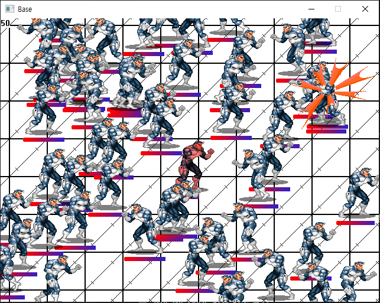
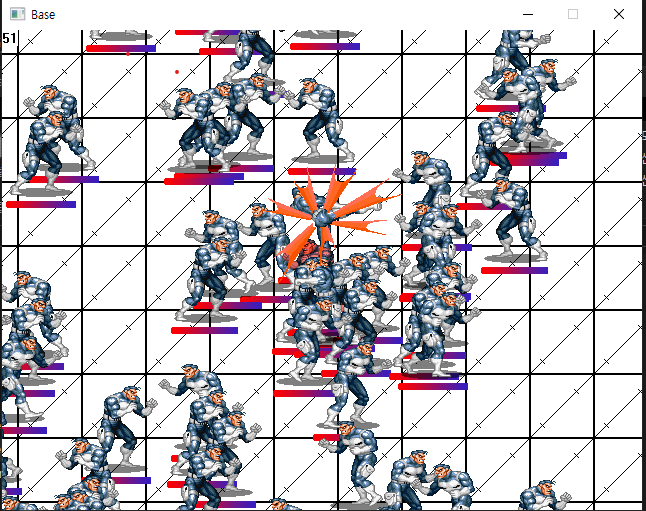
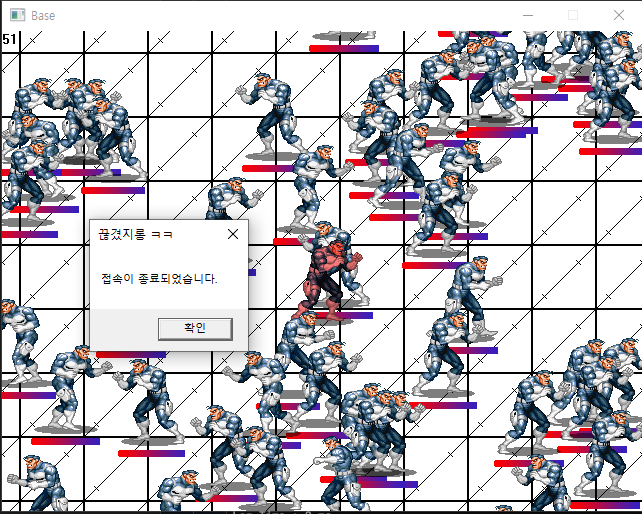
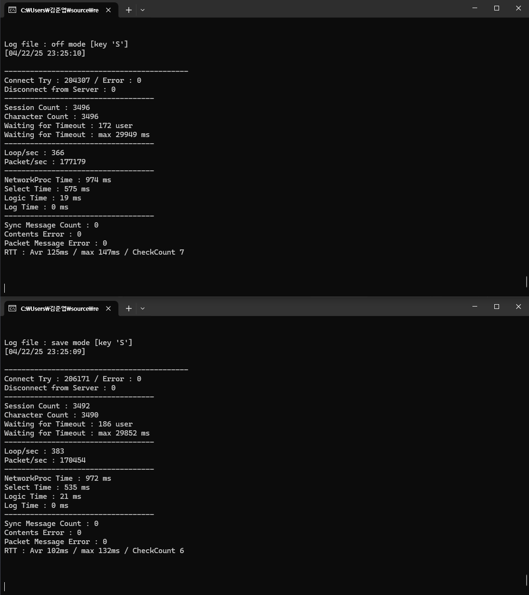
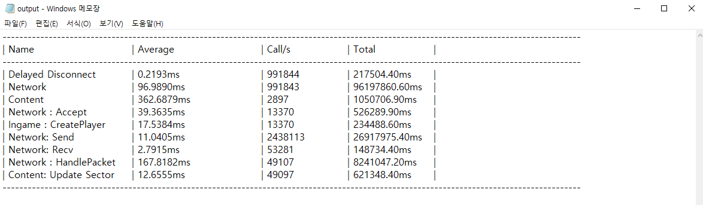

# FightGameMMO

## 📌 목차
- [개요](#개요)
- [게임 설명](#게임-설명)
- [게임 플레이](#게임-플레이)
- [테스트](#테스트)
- [폴더 구조](#폴더-구조)

---

## 개요
- **프로젝트 이름**: FightGameMMO  
- **개발 기간**: 2024.12 ~ 2025.02 (3개월)  
- **개발 언어**: C++  
- **개발 인원**: 1명 (김준엽)

---

## 게임 설명
FightGameMMO는 단일 스레드 기반의 **실시간 멀티 유저 전투 게임 서버**입니다.  
사용자의 입력을 서버에서 처리하고, 이를 다른 유저에게 실시간으로 전파하는 구조를 갖추고 있습니다.  
세션 관리, 송수신 버퍼, 콘텐츠 업데이트, 프로토콜 직렬화 등 **MMO 서버의 기본 구조와 동작 흐름**을 구현했습니다.

---

## 게임 플레이

### 🎮 조작 키
| 동작         | 키보드 | 방향키 |
|--------------|--------|--------|
| 이동 - 상     |        | ⬆️     |
| 이동 - 좌     |        | ⬅️     |
| 이동 - 하     |        | ⬇️     |
| 이동 - 우     |        | ➡️     |
| 왼손 주먹     | Z      |        |
| 오른손 주먹   | X      |        |
| 발차기        | C      |        |

- 본인 캐릭터는 **빨간색**으로 표시됩니다 (타 유저 시점에서는 X).

- 공격 히트 시 **이펙트 발생**

- 캐릭터 사망 시 **자동 접속 종료**

---

## 테스트

### 더미 클라이언트 부하 테스트
- **7,000명 이상의 더미 클라이언트 접속** 환경에서 테스트 진행
- 다양한 상황에서 발생 가능한 오류 및 상태 체크 수행

#### 체크리스트
- [x] Connect Error 발생 여부 확인
- [x] Sync Message 이상 여부 확인
- [x] Disconnect from Server 체크
- [x] Contents Error 발생 여부 확인
- [x] Packet Message Error 발생 여부 확인
- [x] 30초 이상 무입력 시 강제 접속 종료
- [x] 세션 개수와 캐릭터 수 일치 여부 확인

### 주요 함수 호출 성능 테스트
- 서버 성능 분석을 위한 주요 함수 단위 프로파일링 결과입니다.
IO 처리, 콘텐츠 갱신, 세션 관리 등 핵심 로직의 평균 처리 시간을 측정했습니다.

---

## 폴더 구조

<pre>
📦FightGameMMO 
┣ 📂Core # 핵심 유틸리티 및 공통 기능
┃  ┣ 📜RingBuffer.h
┃  ┣ 📜SerializePacket.h
┃  ┣ 📜pch.h
┃  ┗ 📜main.cpp
┣ 📂Log # 로깅 및 디버깅
┃ ┣ 📜SystemLog.cpp
┃ ┗ 📜CrashDump.cpp
┣ 📂Profiler # 성능 분석 관련 모듈
┃ ┗ 📜Profiler.cpp
┣ 📂Network # 네트워크 및 세션 처리
┃ ┣ 📜NetworkManager.cpp
┃ ┣ 📜Session.cpp
┃ ┣ 📜Protocol.h
┃ ┗ 📜SetSCPacket.cpp
┣ 📂ObjectPool # 오브젝트 재사용/풀링 시스템
┃ ┗ 📜ObjectPoolManager.cpp
┣ 📂Game # 게임 콘텐츠 및 로직
┃ ┣ 📜IngameManager.cpp
┃ ┣ 📜Player.cpp
┃ ┗ 📜Sector.cpp
┗
</pre>
